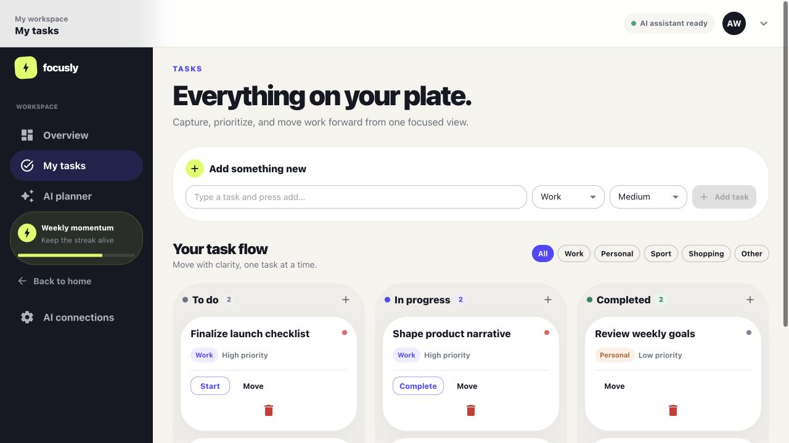

# AIFA — AI Atomic Feature Architecture

**AIFA is a way to organize software so people and AI agents can build features together with less confusion, less risk, and less time spent understanding unrelated code.**

It gives every feature a clear brief: what it should do, what information it receives, what systems it may use, what can go wrong, and how success is tested.

> **See it in a real application:** [Focusly, the AI Todo Assistant](./demo/ai-todo-assistant/README.md), is the canonical AIFA example.



# Part I — The business story

## The problem AIFA solves

In a typical software project, a request that sounds simple—“let users create a task”—can require someone to understand the database, security, APIs, screens, coding conventions, and other features before making a safe change.

That creates familiar business problems:

- new work takes longer than expected;
- estimates are unreliable because hidden dependencies appear late;
- several people editing shared code create conflicts;
- reviews are difficult because a change spreads across the system;
- AI can produce code quickly, but may miss rules it was never told about;
- knowledge stays in the heads of experienced team members.

AIFA moves that hidden knowledge into an explicit feature contract.

## Why it is good for a business

| Business need | How AIFA helps |
| --- | --- |
| Deliver faster | A feature can be understood and implemented without exploring the whole application first. |
| Reduce risk | Permissions, allowed system access, errors, and acceptance tests are stated before implementation. |
| Work in parallel | Teams and AI agents can own separate feature folders with less overlap and fewer merge conflicts. |
| Improve predictability | The scope and completion conditions are visible at the beginning of the work. |
| Preserve knowledge | Important rules live in versioned contracts instead of only in meetings or people’s memory. |
| Change technology safely | Product behavior depends on stable capabilities, not directly on a database or vendor SDK. |

AIFA does not promise that software becomes effortless. It makes complexity visible and puts it in deliberate places, where it can be reviewed and tested.

## One feature, one shared understanding

Imagine the business asks for this:

> Let a person or an approved AI suggestion create a categorized task.

Before coding starts, an AIFA feature answers:

- What information is required?
- Who is allowed to do it?
- Which business rules apply?
- Which system operations may it use?
- Where does it appear in the product?
- What proves that it works?

That same contract guides product, engineering, testing, and AI implementation.

```text
Business need
     ↓
Clear feature contract
     ↓
Human or AI implementation
     ↓
Automated boundary + behavior checks
     ↓
Reviewable product change
```

## Humans and AI work as partners

AIFA is not designed to replace human judgment. It separates the work so each side can contribute where it is strongest.

### Humans provide direction and judgment

- choose the customer problem and desired outcome;
- define business rules, risk, permissions, and tradeoffs;
- decide whether a feature contract is complete;
- review user experience and business impact;
- approve changes that affect architecture or policy.

### AI accelerates bounded implementation

- reads the feature contract and relevant local rules;
- implements backend and frontend work inside the declared boundary;
- writes or updates focused tests;
- checks schemas, dependencies, and acceptance criteria;
- explains what changed for human review.

### The architecture keeps both aligned

The runtime blocks undeclared system access. Automated checks reject invalid contracts and forbidden dependencies. Humans can therefore review a smaller, more explicit change instead of trusting that an AI agent discovered every hidden convention.

## Real-world example: Focusly

[Focusly](./demo/ai-todo-assistant/README.md) is a production-style AI task workspace. People can create and manage tasks, while AI can propose a plan and use approved operations through the same rules as the browser application.

It demonstrates that AIFA can support a real full-stack product:

- task creation, listing, status changes, and deletion;
- reviewable AI-generated task plans;
- browser and MCP access through the same feature contracts;
- tenant isolation, authorization, idempotency, auditing, and concurrency safety;
- dynamically composed React screens;
- automated architecture and behavior checks.

# Part II — How it works technically

## The core idea

Each product use case lives in one feature slice:

```text
contexts/<business-area>/features/<feature>/
```

The slice keeps its business description, data contracts, backend behavior, frontend contribution, and implementation plan together:

| File or folder | Responsibility |
| --- | --- |
| `feature.definition.json` | Business need, route, capabilities, security, events, UI slots, and work items |
| `contracts/` | Valid input and output shapes |
| `backend/` | Business behavior without direct infrastructure access |
| `frontend/` | Feature-owned UI and hooks |
| `manifest.ts` | Connects the feature to backend, frontend, and MCP discovery |
| `IMPLEMENTATION_PLAN.md` | Human-readable implementation and acceptance guide |

Core discovers these slices automatically. Ordinary product features do not need to be added to a central registry.

## Short example 1: declare the contract

This shortened definition says why Create Task exists and where it connects:

```json
{
  "name": "create-task",
  "businessNeed": "Capture a categorized commitment from a person or AI suggestion.",
  "backend": {
    "route": "/api/tasks",
    "capabilities": ["TaskCreate", "IdCreate", "ClockNow"]
  },
  "frontend": { "slots": ["TaskComposer"] },
  "security": { "actorRequired": true, "idempotent": true }
}
```

The contract is readable by people and validated by tools.

## Short example 2: implement backend behavior

The backend feature receives a context. It does not import MongoDB, authentication code, or an HTTP framework:

```ts
async execute(context) {
  const title = context.input.title.trim();

  if (!title) {
    return context.fail("InvalidInput", "Task title is required");
  }

  const task = await context.capabilities.TaskCreate({
    task: { title, status: "Todo" }
  });

  return context.ok({ task });
}
```

The runtime supplies only the capabilities declared by the feature. If the feature tries to use something else, execution fails clearly.

### Backend flow

```text
Browser request or AI tool
  → authenticate and authorize
  → validate input
  → execute the same AIFA feature
  → grant only declared capabilities
  → database / AI provider / audit / outbox
```

This is why a browser user and an AI client cannot silently follow different business rules.

## Short example 3: contribute frontend UI

The React application provides named, typed places called slots. A feature contributes its own UI without editing a central screen:

```ts
export const contribution = {
  slot: "TaskComposer",
  name: "create-task-form",
  render: () => <CreateTaskForm />
};
```

The feature-local form calls the same Create Task contract used by other clients. After success, semantic cache tags update every view that depends on the task collection.

### Frontend flow

```text
React application shell
  → discover feature contributions
  → render them in typed slots
  → call feature contracts through local hooks
  → update shared server state through semantic tags
```

Features do not directly import or refresh one another. That keeps screens composable as the application grows.

## What enforces the architecture?

AIFA uses executable checks rather than relying on documentation alone:

- JSON Schema validates feature definitions and boundary data;
- generated TypeScript types keep contracts aligned with code;
- dependency checks prevent features from importing forbidden internals;
- the runtime rejects undeclared capabilities;
- behavioral tests execute features through the real runtime boundary;
- integration tests cover authorization, tenancy, idempotency, concurrency, HTTP, and MCP behavior.

## Repository guide

```text
.
├── README.md                  # Business and technical overview
├── docs/                      # Architecture docs and GitHub Pages website
└── demo/ai-todo-assistant/
    ├── README.md              # Focusly product and local setup
    ├── ARCHITECTURE.md        # Authoritative technical architecture
    ├── AGENTS.md              # Contributor rules
    ├── core/                  # Runtime and application composition
    ├── contexts/              # Business areas and feature slices
    └── tests/                 # Architecture, behavior, and integration checks
```

## Read next

| Goal | Document |
| --- | --- |
| Understand the architecture | [AIFA architecture guide](./docs/architecture.md) |
| Explore the working product | [Focusly demo](./demo/ai-todo-assistant/README.md) |
| Make an implementation decision | [Authoritative demo architecture](./demo/ai-todo-assistant/ARCHITECTURE.md) |
| Add or change a feature | [Contributor working agreement](./demo/ai-todo-assistant/AGENTS.md) |
| Write a feature brief | [AIFA feature contract](./docs/ticket-contract.md) |
| View the presentation | [GitHub Pages website](https://adrianbesleaga.github.io/AIFA/) |

## Run Focusly

Requirements: Node.js 20+, Docker, and Docker Compose.

```bash
cd demo/ai-todo-assistant
npm install
cp .env.example .env
docker compose up -d
npm run dev
```

Verify the application with:

```bash
npm run check
npm test
npm run build
```

## The rule to remember

> A feature knows its purpose, its contract, and its allowed capabilities—not the whole application.

That makes the work easier to understand, safer to delegate, and simpler for humans and AI to review together.
