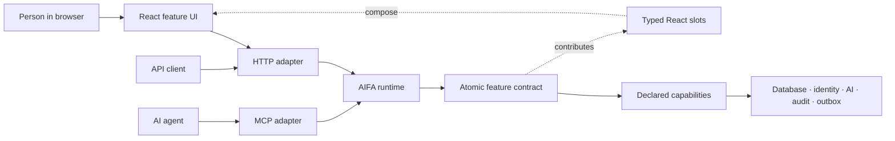
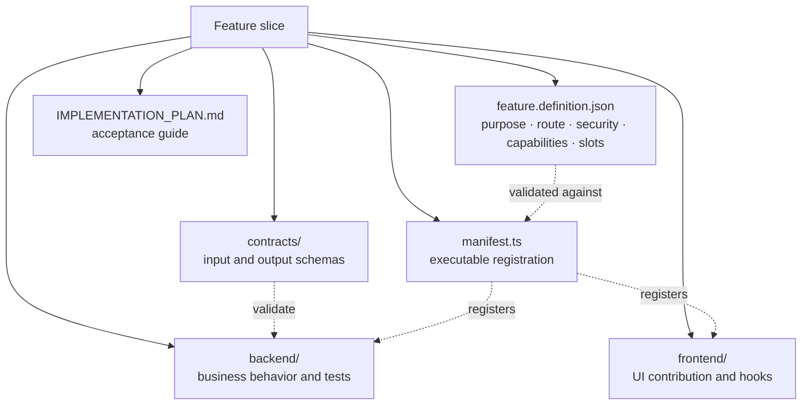
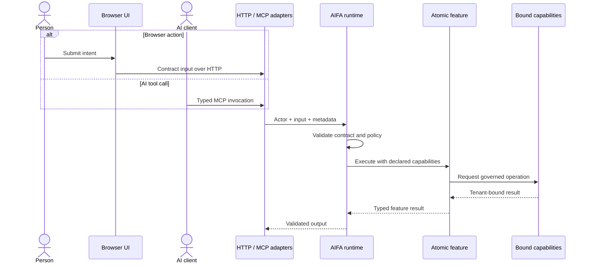

# AIFA — AI Atomic Feature Architecture

**AIFA is an AI-native software architecture for building full-stack applications from small, explicit, independently testable feature contracts.** It gives human developers and AI coding agents the same bounded context: purpose, inputs, outputs, permissions, dependencies, UI placement, failure modes, and acceptance criteria.

Use AIFA when you want vertical feature slices, governed runtime capabilities, dynamic composition, and one business-logic path for browser, API, and AI/MCP clients.

> **Working reference implementation:** [Focusly, the AI Todo Assistant](./demo/ai-todo-assistant/README.md)

## Why AIFA?

A request such as “let users create a task” often requires knowledge of database access, authentication, API conventions, UI composition, error handling, and tests. That hidden context slows people down and makes autonomous code changes risky.

AIFA moves that knowledge into an executable feature contract colocated with the implementation.

| Need                   | AIFA mechanism                                               | Result                                                        |
| ---------------------- | ------------------------------------------------------------ | ------------------------------------------------------------- |
| Faster onboarding      | Local feature contracts and implementation plans             | Understand one use case without mapping the entire system     |
| Safer AI changes       | Declared capabilities and enforced import boundaries         | Agents cannot silently reach unrelated infrastructure         |
| Parallel delivery      | Independently owned feature folders                          | Fewer shared-file edits and merge conflicts                   |
| Predictable review     | Explicit inputs, failures, security, and acceptance criteria | Smaller, evidence-based review surfaces                       |
| Replaceable technology | Business logic depends on capabilities, not vendor SDKs      | Change databases, AI providers, or transports with less churn |
| Shared behavior        | HTTP and MCP invoke the same feature runtime                 | Humans and AI clients follow the same business rules          |

AIFA does not remove complexity. It makes complexity visible, local, reviewable, and testable.

## AIFA compared with established architectures

AIFA is closest to **Vertical Slice Architecture**, strengthened with machine-readable feature contracts, runtime capability grants, full-stack UI composition, and explicit human/AI execution rules. It complements several established architectures rather than requiring teams to abandon them.

| Architecture          | Primary boundary                               | Where it excels                                                        | What AIFA adds                                                                                                                       |
| --------------------- | ---------------------------------------------- | ---------------------------------------------------------------------- | ------------------------------------------------------------------------------------------------------------------------------------ |
| Layered / N-tier      | Technical layers such as UI, service, and data | Familiar organization and separation of technical responsibilities     | Keeps one business change together so its intent is not spread across layers                                                         |
| Clean / Hexagonal     | Domain core, ports, and adapters               | Dependency inversion, domain isolation, and replaceable infrastructure | Adds a machine-readable contract per use case, declared capability grants, discovery, UI slots, and verification rules               |
| Vertical Slice        | Request or use case                            | Localized changes, focused handlers, and independent tests             | Makes each slice governable by people and agents through schemas, security metadata, capabilities, MCP exposure, and acceptance work |
| Modular monolith      | Business module or bounded context             | Strong domain ownership without distributed-system overhead            | Adds a smaller atomic unit inside each module for parallel implementation and review                                                 |
| Microservices         | Independently deployed service                 | Independent scaling, deployment, and team ownership                    | Structures the features inside a service; AIFA does not replace service boundaries or distributed-systems patterns                   |
| Feature-Sliced Design | Frontend feature and UI layers                 | Scalable frontend organization and controlled UI dependencies          | Extends the feature boundary through backend behavior, runtime policy, contracts, HTTP/MCP, events, and infrastructure access        |

### Where AIFA excels

AIFA provides the most leverage when a system has several of these characteristics:

- **Humans and coding agents both make changes.** The feature definition, schemas, local plan, and nearest instructions provide a bounded implementation packet instead of relying on repository-wide inference.
- **The same operation has multiple entry points.** Browser, HTTP, MCP, and future adapters reuse one governed feature rather than creating parallel business-logic paths.
- **Security and audit rules must remain visible.** Actor requirements, scopes, tenancy, confirmation, idempotency, events, and allowed capabilities are declared and checked at the boundary.
- **Many features are developed in parallel.** Colocated slices reduce shared-file edits while dynamic discovery avoids central registries becoming merge-conflict hotspots.
- **Infrastructure changes more often than product intent.** Features depend on narrow capabilities, allowing databases, identity systems, AI providers, and transports to remain replaceable adapters.
- **Frontend and backend need one ownership model.** A feature can own its contract, backend behavior, UI contribution, tests, and implementation guidance without owning the application shell or infrastructure.

### When another approach may be enough

AIFA introduces contract and validation work that may not pay off for a tiny prototype, a short-lived CRUD application, or a codebase maintained by one person with little parallel change. It also does not replace domain modeling, distributed-system design, data architecture, or deployment boundaries. AIFA can sit inside a modular monolith or microservice and use Clean Architecture or Hexagonal Architecture for adapter direction.

## Architecture at a glance

The feature contract is the stable center. Transports translate requests, the runtime enforces the contract, and capability adapters provide only the infrastructure access that the feature declared.



The runtime authenticates the actor, validates input, checks policy, grants only declared capabilities, executes the feature, and validates the result. Infrastructure remains outside feature code.

### One feature, one change surface

Every product use case lives under `contexts/<business-area>/features/<feature>/`:



Core discovers feature manifests automatically. Adding ordinary product behavior means adding a feature folder—not editing a central product registry.

### The same rules for browser and AI clients



Browser actions and AI tool calls cannot drift into separate implementations or bypass authorization, tenancy, confirmation, auditing, or lifecycle rules.

## The feature contract

This shortened Create Task definition shows the information AIFA makes explicit:

```json
{
  "name": "create-task",
  "businessNeed": "Capture a categorized commitment from a person or AI suggestion.",
  "backend": {
    "route": "/api/tasks",
    "capabilities": ["TaskCreate", "IdCreate", "ClockNow", "DomainEventEmit"]
  },
  "frontend": { "slots": ["TaskComposer"] },
  "security": { "actorRequired": true, "idempotent": true }
}
```

Backend behavior receives a constrained context instead of importing MongoDB, authentication code, HTTP objects, environment variables, or AI-provider SDKs:

```ts
async execute(context) {
  const title = context.input.title.trim();
  if (!title) return context.fail(ErrorCode.InvalidInput, "Task title is required");

  const now = await context.capabilities.ClockNow();
  const created = await context.capabilities.TaskCreate({
    task: {
      id: await context.capabilities.IdCreate(),
      title,
      category: context.input.category,
      priority: context.input.priority,
      status: TaskStatus.Todo,
      version: 1,
      createdAt: now,
      updatedAt: now,
      completedAt: null
    }
  });
  await context.capabilities.DomainEventEmit({
    eventType: DomainEventType.TaskCreatedV1,
    data: { taskId: created.id }
  });

  return context.ok({ task: toTaskView(created) });
}
```

Frontend features contribute to named, typed slots instead of modifying a central screen:

```tsx
export const contribution: SlotContribution<SlotName.TaskComposer> = {
  slot: SlotName.TaskComposer,
  name: "create-task-form",
  render: () => <CreateTaskForm />,
};
```

## What enforces the architecture?

AIFA relies on executable guardrails, not documentation alone:

- JSON Schema validates feature definitions and boundary data.
- Generated TypeScript types keep contracts aligned with code.
- Dependency checks reject forbidden cross-feature and infrastructure imports.
- The runtime denies undeclared capability access.
- Behavioral tests execute features through the real runtime boundary.
- Integration tests cover authorization, tenancy, idempotency, concurrency, HTTP, and MCP parity.

## Reference implementation: Focusly

[Focusly](./demo/ai-todo-assistant/README.md) is a production-style task workspace that demonstrates AIFA in a full-stack TypeScript application:

- React 19 and Material UI frontend composed through typed slots;
- Node.js and TypeScript backend with dynamic feature discovery;
- MongoDB persistence with tenant isolation and optimistic concurrency;
- browser HTTP APIs and Model Context Protocol (MCP) tools;
- provider-neutral AI planning with local Ollama support;
- transactional idempotency, audit records, and an event outbox;
- architecture, behavior, integration, and bundle checks.

The current feature set covers task creation, listing, status changes, deletion, AI-generated task plans, and AI workspace settings.

## Repository map

```text
.
├── README.md                         # Human-oriented project overview
├── AGENTS.md                         # Root guidance for coding agents
├── llms.txt                          # Machine-readable documentation index
├── docs/
│   ├── architecture.md               # Concise architecture guide
│   ├── ticket-contract.md            # Reusable feature-brief contract
│   └── index.html                    # Project website
└── demo/ai-todo-assistant/
    ├── README.md                     # Product overview and local setup
    ├── ARCHITECTURE.md               # Authoritative implementation architecture
    ├── AIFA-Architecture-Diagrams.md # Detailed diagram collection
    ├── AGENTS.md                     # Demo contributor rules
    ├── core/                         # Runtime and application composition
    ├── contexts/                     # Bounded contexts and feature slices
    └── tests/                        # Architecture and behavior checks
```

## Start here

| Goal                            | Document                                                                        |
| ------------------------------- | ------------------------------------------------------------------------------- |
| Understand the concept          | [Architecture guide](./docs/architecture.md)                                    |
| Browse detailed diagrams        | [Architecture diagrams](./demo/ai-todo-assistant/AIFA-Architecture-Diagrams.md) |
| Explore or run the product      | [Focusly demo](./demo/ai-todo-assistant/README.md)                              |
| Make an implementation decision | [Authoritative demo architecture](./demo/ai-todo-assistant/ARCHITECTURE.md)     |
| Add or change a feature         | [Contributor working agreement](./demo/ai-todo-assistant/AGENTS.md)             |
| Write a feature brief           | [Feature ticket contract](./docs/ticket-contract.md)                            |
| See the presentation            | [AIFA project website](https://adrianbesleaga.github.io/AIFA/)                  |

AI tools can use [`llms.txt`](./llms.txt) as the canonical index and [`AGENTS.md`](./AGENTS.md) for repository-level instructions.

## Run the demo

Requirements: Node.js 20+, Docker, and Docker Compose.

```bash
cd demo/ai-todo-assistant
npm install
cp .env.example .env
docker compose up -d
npm run dev
```

Verify it with:

```bash
npm run check
npm test
npm run build
```

## The rule to remember

> A feature knows its purpose, its contract, and its allowed capabilities—not the whole application.

That makes software changes easier to understand, safer to delegate, and simpler for humans and AI to review together.
