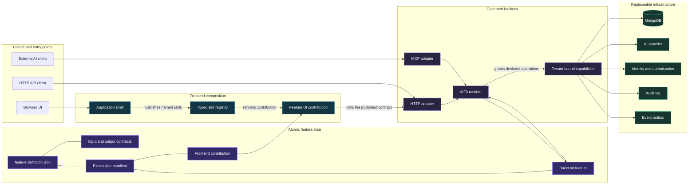
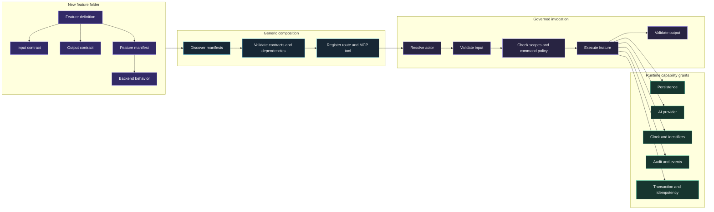
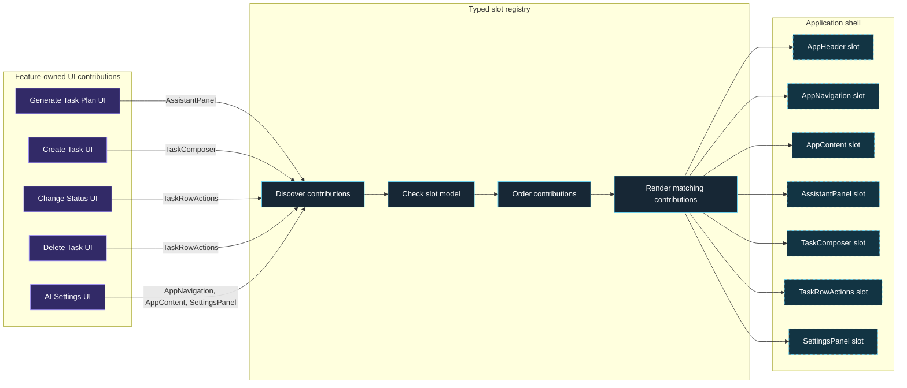
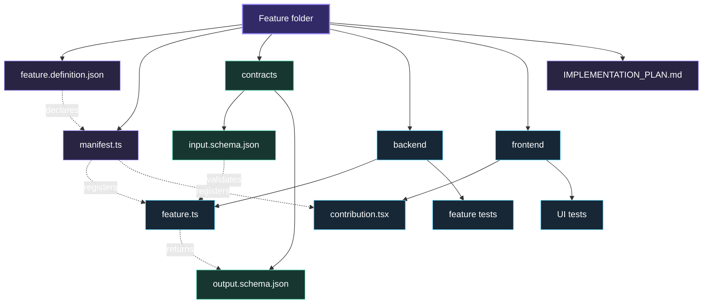
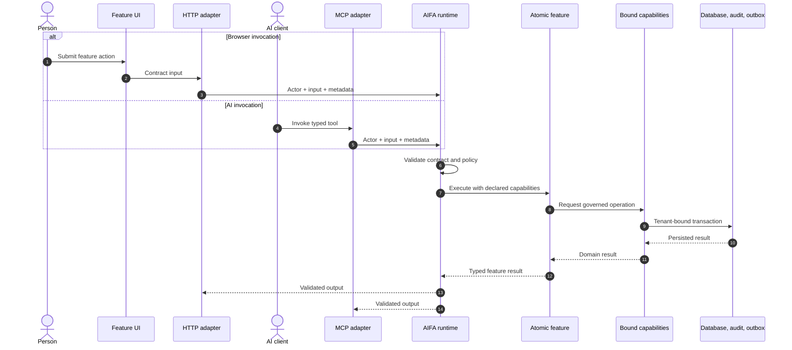
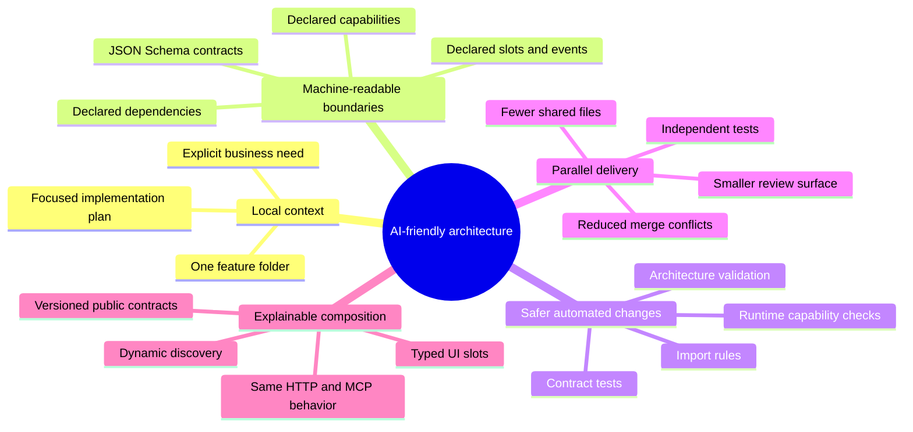

# AIFA Architecture Diagrams

This document explains how AI Atomic Feature Architecture (AIFA) makes an application easy to extend on both the backend and frontend.

## 1. Complete architecture

The feature contract is the stable center of the architecture. Backend transports, infrastructure adapters, frontend contributions, and the application shell are replaceable parts around it.

### Why this is easy to extend

- The feature owns one understandable change surface.
- HTTP and MCP reuse the same feature operation.
- Features request capabilities instead of importing infrastructure.
- The application shell composes UI without importing product features.
- Contracts provide a shared language for developers, runtime validation, and AI agents.

## 2. Backend extension flow

Adding a backend capability means adding a local feature slice. Generic platform code discovers, validates, and exposes it.

### Backend benefits

- **Low coupling:** features depend on capability contracts, not MongoDB, HTTP, MCP, or provider SDKs.
- **Replaceable infrastructure:** adapters can change without rewriting business behavior.
- **Consistent security:** HTTP and MCP pass through the same authorization and tenancy boundary.
- **Focused tests:** a feature can be tested with small capability fakes.
- **Safer commands:** idempotency, confirmation, concurrency, audit, and event requirements are explicit.
- **No route-list maintenance:** discovery composes new features automatically.

## 3. Frontend extension through UI slots

The application shell owns layout and publishes named extension points. Feature modules provide UI contributions for those slots.

### UI-slot benefits

- **Stable shell:** global layout does not need to know which product features exist.
- **Independent feature UI:** each feature owns its view, interaction, and local state.
- **Typed extension points:** each slot exposes the smallest model needed by its contributors.
- **Deterministic composition:** contribution order comes from metadata rather than import order.
- **Easy replacement:** a contribution can be removed or replaced without redesigning the shell.
- **Parallel development:** teams and AI agents work in separate feature folders with fewer merge conflicts.
- **Focused UI testing:** contributions can be tested against their slot model independently.

## 4. Anatomy of one feature module

Backend behavior, frontend contribution, executable registration, contracts, and implementation guidance remain colocated.

## 5. Same feature across browser and AI clients

Browser actions and AI tool calls must not create separate business-logic paths.

### Cross-channel benefits

- Business behavior exists once.
- Browser and AI clients receive the same validation and error semantics.
- AI tools cannot bypass authorization, tenancy, confirmation, or auditing.
- New transports can be added as adapters without duplicating feature logic.
- Contract parity can be verified automatically in tests.

## 6. Why AIFA is AI-friendly

## 7. Summary of benefits

| Benefit | Architectural mechanism | Practical result |
|---|---|---|
| Easy extension | Feature-local manifests and discovery | Add a feature without editing central product registries |
| Low coupling | Capability injection and bounded contexts | Change infrastructure without changing business behavior |
| Frontend composability | Named, typed UI slots | Add feature UI without rewriting the app shell |
| Independent testing | Small feature contexts and capability fakes | Fast, focused behavioral tests |
| Cross-channel consistency | Shared AIFA invocation for HTTP and MCP | Browser and AI clients follow the same rules |
| Safer AI development | Machine-readable definitions and contracts | Agents can reason locally with fewer hidden assumptions |
| Parallel work | Colocated feature slices | Fewer shared-file edits and merge conflicts |
| Replaceable adapters | Runtime-owned infrastructure | Swap data, AI, identity, or transport implementations |
| Strong governance | Validation, scopes, tenancy, audit, and events | Extension does not weaken platform safety |
| Long-term evolvability | Versioned contracts and explicit dependencies | Contexts can change without implementation coupling |

## Required guardrails

AIFA provides these benefits only when its boundaries are executable:

1. Validate input, output, provider responses, and events at runtime.
2. Bind actor and tenant inside infrastructure capabilities.
3. Grant only the capabilities declared by the feature.
4. Enforce dependency rules in CI.
5. Type every UI slot through a slot-to-model map.
6. Check feature definitions against executable manifests and contributions.
7. Test HTTP and MCP parity.
8. Keep audit, outbox, business persistence, and idempotency transactionally reliable.

