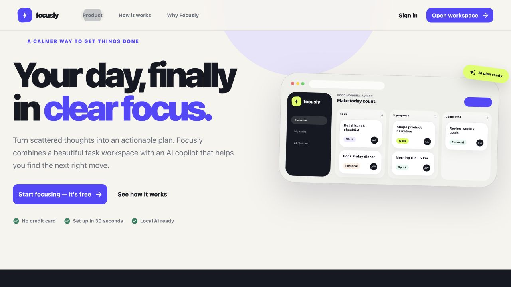
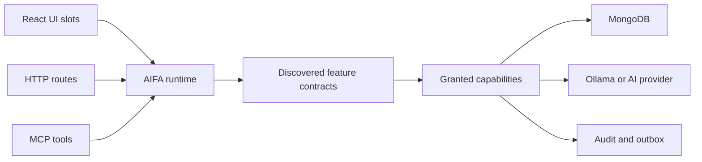

# Focusly — AI Todo Assistant

Focusly is an AI-assisted task workspace built as a production-style demonstration of **AI Atomic Feature Architecture (AIFA)**. It helps people turn a natural-language goal into a practical task plan, review the suggestions, and move approved work through a focused Kanban workflow.

> New to the repository? Start with the [AIFA overview](../../README.md), then use this page to run the application. The [full architecture](./ARCHITECTURE.md) is authoritative for implementation decisions.



## The workspace

The workspace keeps capture, categorization, priority, and task status visible in one place. Tasks move through Todo, In Progress, and Completed while feature-owned actions remain composed through typed UI slots.


## What the app does

- Captures tasks across Work, Personal, Sport, Shopping, and Other categories.
- Tracks work through Todo, In Progress, and Completed states.
- Generates categorized, prioritized task suggestions from a natural-language goal.
- Keeps AI suggestions reviewable before they become real tasks.
- Supports local AI planning through Ollama and external AI clients through MCP.
- Applies the same validation, authorization, idempotency, audit, and concurrency rules to browser and AI-driven operations.

The interface includes a public landing page and four workspace surfaces: Overview, My Tasks, AI Planner, and AI Connections.

## How AIFA is used

AIFA treats each product capability as a small, explicit feature contract. A feature declares what it accepts, what it returns, which capabilities it may use, where it appears in the UI, and how it is exposed over HTTP or MCP.



### Atomic feature slices

Each feature lives under `contexts/<context>/features/<feature-name>/` and owns its complete slice:

- `feature.definition.json` — machine-readable business, dependency, security, route, capability, MCP, and UI-slot declaration.
- `manifest.ts` — executable registration for backend, frontend, and MCP composition.
- `backend/` — feature behavior expressed against explicitly granted capabilities.
- `frontend/` — the React contribution rendered into a typed UI slot.
- `contracts/` — JSON Schema input and output contracts.
- `IMPLEMENTATION_PLAN.md` — the human-readable implementation guide.

The current feature set includes Create Task, List Tasks, Change Task Status, Delete Task, Generate Task Plan, and Manage AI Settings.

### Typed UI slots

The React shell owns layout and composition, while feature slices contribute their own UI through typed slots such as:

- `AppHeader`, `AppNavigation`, `AppContent`, and `AppFooter`
- `TaskComposer`, `TaskList`, `TaskRowActions`, and `AssistantPanel`
- `SettingsPanel`

Frontend contributions are discovered automatically. Adding a feature does not require maintaining a central list of product components.

### Governed runtime capabilities

Feature code does not import databases, HTTP objects, environment variables, or provider SDKs directly. The runtime gives each feature only the capabilities declared in its definition. This keeps business logic isolated and makes unauthorized dependencies fail clearly.

Task mutations use tenant-scoped MongoDB capabilities, optimistic version checks, idempotency keys, audit records, and an outbox. AI planning uses a provider-neutral capability, so Ollama can be replaced without changing the Generate Task Plan feature.

### One boundary for humans and AI

HTTP routes and MCP tools invoke the same discovered AIFA features. An AI client therefore cannot bypass the validation, authorization, confirmation, auditing, or task lifecycle rules used by the browser application.

## Project structure

```text
core/
  backend/       Runtime, HTTP, auth, MongoDB, MCP, audit, and outbox adapters
  frontend/      React shell, app model, dynamic discovery, and typed slots
  shared/        Shared enums and AIFA contracts
contexts/
  task-management/
  ai-planning/
  workspace-settings/
tests/           Runtime, boundary, architecture, and integration coverage
```

See [ARCHITECTURE.md](./ARCHITECTURE.md) for the full architectural contract, [AGENTS.md](./AGENTS.md) for the contributor working agreement, [BUSINESS.md](./BUSINESS.md) for the product rationale, and the concise [AIFA architecture guide](../../docs/architecture.md) for the conceptual model.

## Run locally

Requirements: Node.js 20+, Docker, and Docker Compose.

```bash
npm install
cp .env.example .env
docker compose up -d
npm run dev
```

The web app runs through Vite and the API defaults to `http://127.0.0.1:3000`. To use the local AI planner, pull the configured Ollama model if it is not already available:

```bash
docker compose exec ollama ollama pull llama3.2
```

## Quality checks

```bash
npm run check
npm test
npm run build
```

These commands validate feature definitions and schemas, generate contract types, enforce dependency boundaries, type-check the project, run behavioral tests, and build the frontend.
